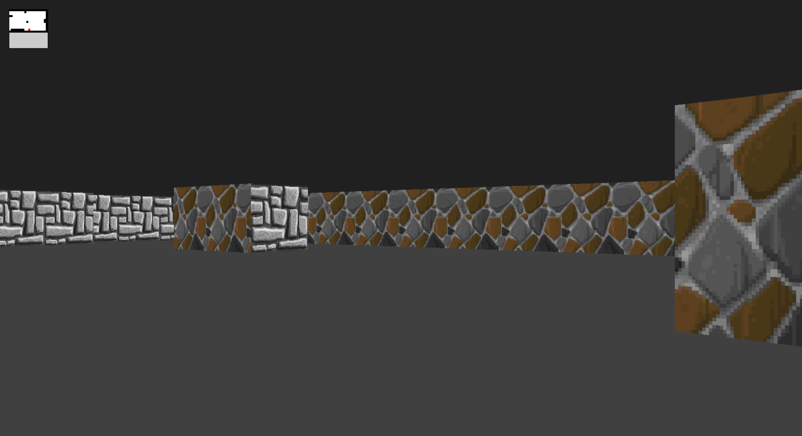

# 42-cub3D


# Introduction

The aim of this project was to introduce us to Raycasting. We have to reproduce the graphic method of the Wolfenstein 3D game.

This project is being developed with the minilibx from 42.

At [42 School](https://github.com/42School), almost every project must be written in accordance to the [Norm](https://github.com/42School/norminette/blob/master/pdf/en.norm.pdf), the school's coding standard. As a result, the implementation of certain parts may appear strange and for sure had room for improvement.

Developed with [loicvitale](https://github.com/loicvitale).

## :zap: Usage

###  :electric_plug: Installation

To install the project, clone this repository :

```shell
$ git clone git@github.com:19-cub3d/42-cub3d.git
```

To compile the game, run this command :

```shell
$ make
```

###  :package: Commands

After compiling the project, the executable file with the name so_long will be created, to run the game call the executable passing the map as an argument:

Example:

```shell
$ ./cub3D assets/maps/map.cub
```

```shell
$ ./cub3D assets/maps/map2.cub
```

To compile the project, run :

```shell
$ make
```

To re-compile the project  :

```shell
$ make re
```

To wipes all object files :

```shell
$ make clean
```

To delete the project and all object files

```shell
$ make fclean
```

###  :notebook: More

You can create your own map.

Your map must be a .cub file. 

It must be surrounded by 1 (wall). 

The map must be composed of just these 6 characters: 0 for empty spaces 1 for walls, and N, S, E or W, which represent the player's starting position and orientation.

Example :

```
NO ./assets/wall1.xpm
SO ./assets/wall2.xpm
WE ./assets/wall3.xpm
EA ./assets/wall4.xpm

C 124,159,12
F 255,255,203

		1111111111111111111111111
		1000000000110000000000001
		1011000001110000000000001
		1001000000000000000000001
111111111011000001110000000000001
100000000011000001110111100011111
11110111111111011100000010001
11110111111111011101010010001
11000000110101011100000010001
10000000000000001100000010001
10000000000000001101010010001
11000001110101011111011110N0111
11110111 1110101 101111010001
11111111 1111111 111111111111
```


##  :page_facing_up: Resources
 
[Minilibx Docs](https://harm-smits.github.io/42docs/libs/minilibx)

##  :camera: Gallery

<p align="center">
  
</p>